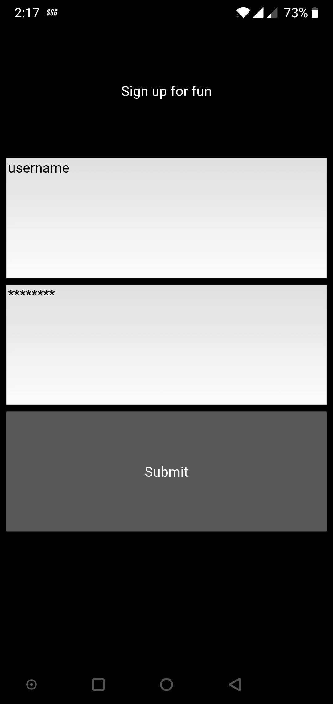
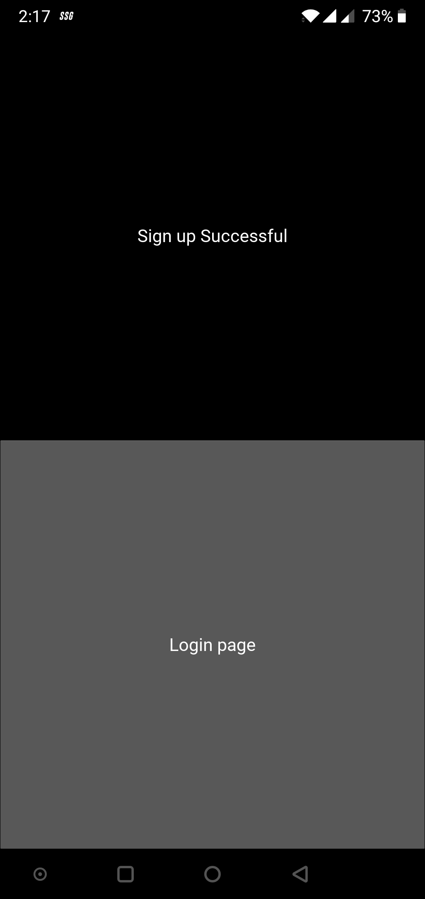
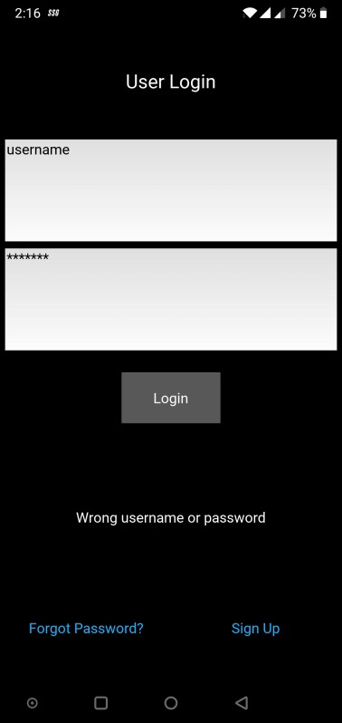
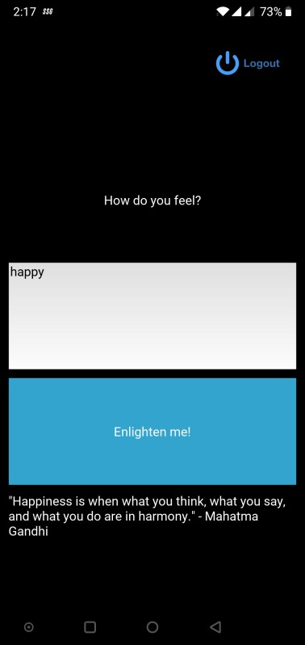

# Feels-Mobile-App
How to run?
* Download the apk file and install in your android phone. 
                          OR
* Download all the files and folders.
* Dependency: 
1) kivy 1.11.1 : 
  For mac and linux users:  
    python3.7 -m pip install kivy(works only on python 3.7 on mac and linux) 
  For windows users: 
    * for python 3.7 or earlier:  pip install kivy 
                                     pip install kivy.deps.glew 
                                     pip install docutils pygments pypiwin32 kivy.deps.sdl2 
    * for python 3.8:  pip install kivy[base] kivy_examples --pre --extra-index-url 
 
Run the main.py file and voila!

## Screenshots

